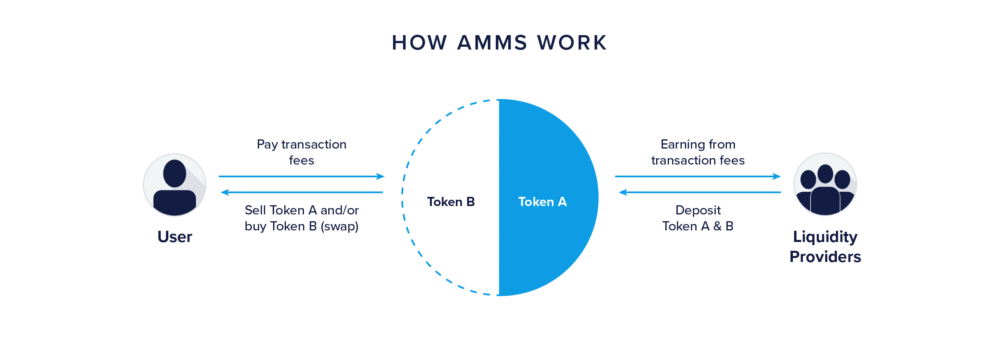
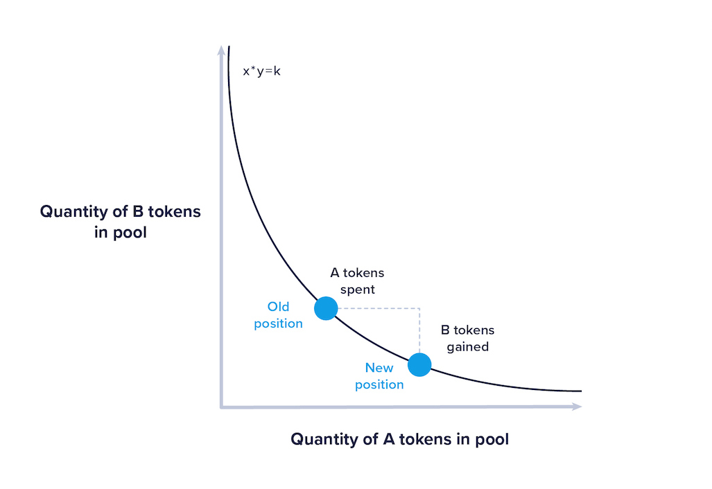
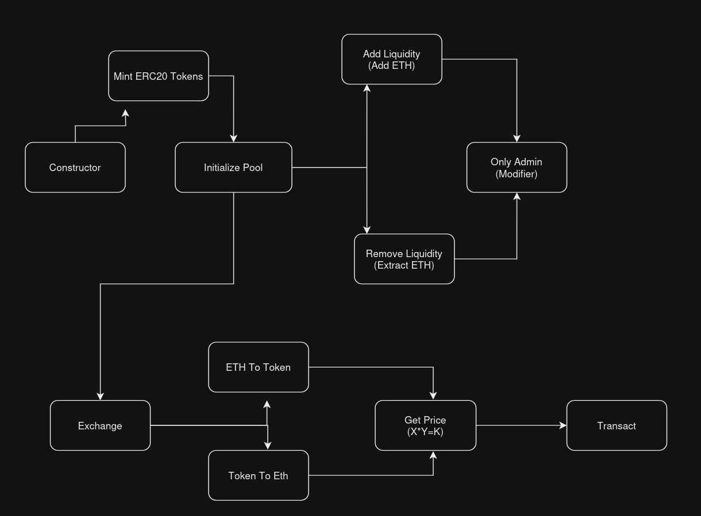

## Decentralized Exchanges (DEXs)

A decentralized exchange (DEX) is a type of cryptocurrency exchange where users can trade directly with each other without needing a middleman or central authority to facilitate the transactions. This exchange is based on blockchain technology and smart contracts, which automatically execute trades based on predefined rules.

Let us now understand the components and working of DEXs:

### Direct Trading
Users trade directly from their wallets. When you want to buy or sell a cryptocurrency, you connect your wallet to the DEX platform (like Uniswap, Sushiswap, Pancakeswap, etc.) and trade with other users.

### Smart Contracts
These are self-executing contracts with the terms of the trade written into code. They automatically handle the transactions, ensuring that both parties complete the trades as agreed upon.

### Liquidity Pools
Users provide funds to these pools to enable trading. In return, they earn a share of the trading fees or receive other incentives.

## Automated Market Makers (AMMs)

In traditional markets and centralized finances, an order book is used. It is a list of buy and sell orders for a specific security or financial instrument, organized by price level. Traders and investors use it to see the current demand and supply for that security. In decentralized finance (DeFi), an Automated Market Maker (AMM) is a system that enables users to trade cryptocurrencies directly with a smart contract rather than with other users. In AMM-based exchanges, there are no direct buyers and sellers. Instead, users trade against a pool of tokens.



### Liquidity Pools

In decentralized finance (DeFi), a liquidity pool is a smart contract-based pool of funds locked in by liquidity providers (LPs). These pools are used by Automated Market Makers (AMMs) to facilitate decentralized trading without the need for traditional order books. Each liquidity pool contains two tokens, such as ETH and DAI (approx 1 USD), in a specific ratio.

### Constant Product Formula

<div style="text-align:center;">
    
</div>
Automated Market Makers (AMMs), commonly used with liquidity pools, employ a mathematical formula to determine token prices and maintain liquidity. One of the most common formulas applied is the constant product formula, which is given as follows:
\[ X * Y = K \]
where \( X \) and \( Y \) are the quantities of the two tokens in the pool, and \( K \) is a constant. This formula ensures that the product of the quantities of the two tokens remains constant. As a result, when one token is bought (increasing its quantity), the other token’s quantity decreases proportionally, adjusting the price accordingly.

### Working of Liquidity Pools

1. **Deposit of Tokens**: Liquidity providers deposit an equal value of two different tokens into the liquidity pool. For example, if they want to contribute liquidity to a pool for ETH and DAI, they might deposit $100 worth of ETH and $100 worth of DAI.

2. **Token Swaps**: When traders want to swap one token for another, they interact directly with the liquidity pool’s smart contract. The AMM calculates the amount of tokens to be exchanged based on the current ratio in the pool and the constant product formula.

3. **Price Adjustments**: Each trade affects the balance of tokens in the pool and adjusts their prices according to the constant product formula. Larger trades may cause slippage, where the price changes due to the execution of the trade.

4. **Earning Fees**: Liquidity providers earn a portion of the trading fees generated by the pool. These fees are distributed proportionally to the providers based on their share of the total liquidity in the pool.

5. **Rebalancing**: As the prices of tokens in the market fluctuate, liquidity providers may need to adjust their holdings to maintain the desired ratio in the pool.

# Example of Liquidity Pool made in Solidity with ERC20 Token.
This Solidity smart contract implements an ERC20 token with a simple liquidity pool. Users can add liquidity, remove liquidity, and swap between ETH and tokens. The contract uses the SafeMath library to ensure safe arithmetic operations.

## Contract Overview

The `TokenWithLiquidityPool` contract extends the ERC20 standard provided by OpenZeppelin and includes additional functionality for managing a liquidity pool. The contract allows the admin to initialize the liquidity pool, add liquidity, remove liquidity, and handle token/ETH swaps.

## Imports

The contract imports two libraries from OpenZeppelin:
- `ERC20`: The standard ERC20 token implementation.
- `SafeMath`: A library for safe mathematical operations, which helps prevent overflow and underflow errors.

```solidity
import "@openzeppelin/contracts/token/ERC20/ERC20.sol";
import "@openzeppelin/contracts/utils/math/SafeMath.sol";
```

## State Variables

- `admin`: The address of the contract administrator.
- `totalLiquidity`: The total amount of tokens in the liquidity pool.
- `ethLiquidity`: The total amount of ETH in the liquidity pool.

```solidity
address public admin;
uint256 public totalLiquidity;
uint256 public ethLiquidity;
```

## Events

The contract defines three events:
- `LiquidityAdded`: Emitted when liquidity is added to the pool.
- `LiquidityRemoved`: Emitted when liquidity is removed from the pool.
- `TokensSwapped`: Emitted when tokens are swapped for ETH or vice versa.

```solidity
event LiquidityAdded(address indexed provider, uint256 tokenAmount, uint256 ethAmount);
event LiquidityRemoved(address indexed provider, uint256 tokenAmount, uint256 ethAmount);
event TokensSwapped(address indexed swapper, uint256 ethAmount, uint256 tokenAmount);
```

## Constructor

The constructor initializes the token with a name ("MyToken") and symbol ("MTK"). It also mints the initial supply of tokens and sets the deployer as the admin.

```solidity
constructor(uint256 initialSupply) ERC20("MyToken", "MTK") {
    _mint(msg.sender, initialSupply);
    admin = msg.sender;
}
```

## Modifiers

The `onlyOwner` modifier restricts access to certain functions to only the admin.

```solidity
modifier onlyOwner() {
    require(msg.sender == admin, "you are not owner");
    _;
}
```

## Functions

### initializePool

This function initializes the liquidity pool with a specified amount of tokens and ETH. It can only be called by the admin and only once.

```solidity
function initializePool(uint256 _tokenAmount) external payable onlyOwner {
    require(totalLiquidity == 0, "Pool already initialized");
    require(_tokenAmount > 0 && msg.value > 0, "Invalid amounts");

    _transfer(msg.sender, address(this), _tokenAmount);
    totalLiquidity = _tokenAmount;
    ethLiquidity = msg.value;

    emit LiquidityAdded(msg.sender, _tokenAmount, msg.value);
}
```

### getPrice

This private function calculates the price for token/ETH swaps based on the constant product formula.

```solidity
function getPrice(uint256 inputAmount, uint256 inputReserve, uint256 outputReserve) private pure returns (uint256) {
    uint256 inputAmountWithFee = inputAmount.mul(997);
    uint256 numerator = inputAmountWithFee.mul(outputReserve);
    uint256 denominator = inputReserve.mul(1000).add(inputAmountWithFee);
    return numerator.div(denominator);
}
```

### ethToToken

This function allows users to swap ETH for tokens. The number of tokens received is calculated using the `getPrice` function.

```solidity
function ethToToken() external payable {
    require(msg.value > 0, "ETH amount should be greater than zero");

    uint256 tokenReserve = balanceOf(address(this));
    uint256 tokensBought = getPrice(msg.value, ethLiquidity, tokenReserve);

    ethLiquidity = ethLiquidity.add(msg.value);
    totalLiquidity = totalLiquidity.sub(tokensBought);

    _transfer(address(this), msg.sender, tokensBought);

    emit TokensSwapped(msg.sender, msg.value, tokensBought);
}
```

### tokenToEth

This function allows users to swap tokens for ETH. The amount of ETH received is calculated using the `getPrice` function.

```solidity
function tokenToEth(uint256 _tokenAmount) external {
    require(_tokenAmount > 0, "Token amount should be greater than zero");

    uint256 tokenReserve = balanceOf(address(this));
    uint256 ethBought = getPrice(_tokenAmount, tokenReserve, ethLiquidity);

    totalLiquidity = totalLiquidity.add(_tokenAmount);
    ethLiquidity = ethLiquidity.sub(ethBought);

    _transfer(msg.sender, address(this), _tokenAmount);
    payable(msg.sender).transfer(ethBought);

    emit TokensSwapped(msg.sender, ethBought, _tokenAmount);
}
```

### addLiquidity

This function allows the admin to add more liquidity to the pool.

```solidity
function addLiquidity(uint256 _tokenAmount) external payable onlyOwner {
    require(_tokenAmount > 0 && msg.value > 0, "Invalid amounts");

    _transfer(msg.sender, address(this), _tokenAmount);
    totalLiquidity = totalLiquidity.add(_tokenAmount);
    ethLiquidity = ethLiquidity.add(msg.value);

    emit LiquidityAdded(msg.sender, _tokenAmount, msg.value);
}
```

### removeLiquidity

This function allows the admin to remove liquidity from the pool.

```solidity
function removeLiquidity(uint256 _tokenAmount, uint256 _ethAmount) external onlyOwner {
    require(_tokenAmount <= totalLiquidity && _ethAmount <= ethLiquidity, "Invalid amounts");

    totalLiquidity = totalLiquidity.sub(_tokenAmount);
    ethLiquidity = ethLiquidity.sub(_ethAmount);

    _transfer(address(this), msg.sender, _tokenAmount);
    payable(msg.sender).transfer(_ethAmount);

    emit LiquidityRemoved(msg.sender, _tokenAmount, _ethAmount);
}
```



## Full Contract Code

```solidity
// SPDX-License-Identifier: MIT
pragma solidity ^0.8.0;

import "@openzeppelin/contracts/token/ERC20/ERC20.sol";
import "@openzeppelin/contracts/utils/math/SafeMath.sol";

contract TokenWithLiquidityPool is ERC20 {
    using SafeMath for uint256;

    address public admin;
    uint256 public totalLiquidity;
    uint256 public ethLiquidity;

    event LiquidityAdded(address indexed provider, uint256 tokenAmount, uint256 ethAmount);
    event LiquidityRemoved(address indexed provider, uint256 tokenAmount, uint256 ethAmount);
    event TokensSwapped(address indexed swapper, uint256 ethAmount, uint256 tokenAmount);

    constructor(uint256 initialSupply) ERC20("MyToken", "MTK"){
        _mint(msg.sender, initialSupply);
        admin = msg.sender;
    }

    modifier onlyOwner(){
        require(msg.sender == admin, "you are not owner");
        _;
    }

    function initializePool(uint256 _tokenAmount) external payable onlyOwner {
        require(totalLiquidity == 0, "Pool already initialized");
        require(_tokenAmount > 0 && msg.value > 0, "Invalid amounts");

        _transfer(msg.sender, address(this), _tokenAmount);
        totalLiquidity = _tokenAmount;
        ethLiquidity = msg.value;

        emit LiquidityAdded(msg.sender, _tokenAmount, msg.value);
    }

    function getPrice(uint256 inputAmount, uint256 inputReserve, uint256 outputReserve) private pure returns (uint256) {
        uint256 inputAmountWithFee = inputAmount.mul(997);
        uint256 numerator = inputAmountWithFee.mul(outputReserve);
        uint256 denominator = inputReserve.mul(1000).add(inputAmountWithFee);
        return numerator.div(denominator);
    }

    function ethToToken() external payable {
        require(msg.value > 0, "ETH amount should be greater than zero");

        uint256 tokenReserve = balanceOf(address(this));
        uint256 tokensBought = getPrice(msg.value, ethLiquidity, tokenReserve);

        ethLiquidity = ethLiquidity.add(msg.value);
        totalLiquidity = totalLiquidity.sub(tokensBought);

        _transfer(address(this), msg.sender, tokensBought);

        emit TokensSwapped(msg.sender, msg.value, tokensBought);
    }

    function tokenToEth(uint256 _tokenAmount) external {
        require(_tokenAmount > 0, "Token amount should be greater than zero");

        uint256 tokenReserve = balanceOf(address(this));
        uint256 ethBought = getPrice(_tokenAmount, tokenReserve, ethLiquidity);

        totalLiquidity = totalLiquidity.add(_tokenAmount);
        ethLiquidity = ethLiquidity.sub(ethBought);

        _transfer(msg.sender, address(this), _tokenAmount);
        payable(msg.sender).transfer(ethBought);

        emit TokensSwapped(msg.sender, ethBought, _tokenAmount);
    }

    function addLiquidity(uint256 _tokenAmount) external payable onlyOwner {
        require(_tokenAmount > 0 && msg.value > 0, "Invalid amounts");

        _transfer(msg.sender, address(this), _tokenAmount);
        totalLiquidity = totalLiquidity.add(_tokenAmount);
        ethLiquidity = ethLiquidity.add(msg.value);

        emit LiquidityAdded(msg.sender, _tokenAmount, msg.value);
    }

    function removeLiquidity(uint256 _tokenAmount, uint256 _ethAmount) external onlyOwner {
        require(_tokenAmount <= totalLiquidity && _ethAmount <= ethLiquidity, "Invalid amounts");

        totalLiquidity = totalLiquidity.sub(_tokenAmount);
        ethLiquidity = ethLiquidity.sub(_ethAmount);

        _transfer(address(this), msg.sender, _tokenAmount);
        payable(msg.sender).transfer(_ethAmount);

        emit LiquidityRemoved(msg.sender, _tokenAmount, _ethAmount);
    }
}
```